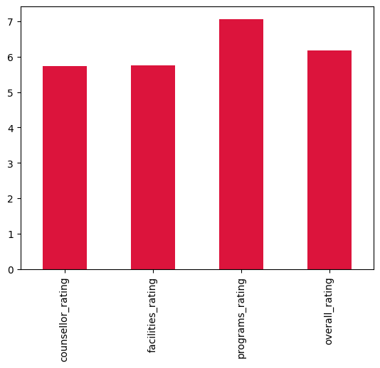

# Sentiment Analysis of Client Feedback at a Drug Counselling Centre

## Project Overview

This project applies unsupervised sentiment analysis to feedback collected from clients at a drug counselling centre.
The clients were asked to give anonymous feedback within a character limit. The analysis focuses on three key experience categories:

- **Service received from counsellors**
- **Facilities at the centre**
- **Support programs offered**

## Sample Client Feedback

| Service received from counsellor                            | Facilities                                         | Support Programs                                         |
|-------------------------------------------------------------|----------------------------------------------------|----------------------------------------------------------|
| My counsellor helped me make sense of my emotions.          | It did the job, no complaints.                     | I stayed mostly quiet and just listened.                 |
| Every session brought me one step closer to recovery.       | The entrance was confusing and not welcoming.      | I didn’t dislike it, but it wasn’t very impactful.       |
| There wasn’t much depth, but it was okay.                   | Great balance of privacy and openness.             | The activities were creative and helped me reflect.      |
| My counsellor helped me make sense of my emotions.          | The garden outside helped me decompress.           | It felt like they were going through the motions.        |
| I didn’t feel any connection with my counsellor.            | Comfortable seating and well-lit rooms.            | The support programs exceeded my expectations.           |

Using pre-trained NLP models, the system automatically evaluates sentiment from client comments and assigns each a score on a **continuous scale from 1 to 10**, allowing for more nuanced understanding than binary classification.

---

##  Objectives

- Quantify client satisfaction in three distinct service areas.
- Identify clients with negative or neutral experiences.

| counsellor_rating | facilities_rating | programs_rating | overall_rating | overall_sentiment       |
|-------------------|-------------------|------------------|----------------|--------------------------|
| 10.0              | 7.8               | 5.5              | 7.77           | Satisfied                |
| 10.0              | 3.2               | 5.5              | 6.23           | Moderately Satisfied     |
| 5.5               | 10.0              | 10.0             | 8.50           | Satisfied                |
| 3.2               | 3.2               | 7.8              | 4.73           | Moderately Dissatisfied  |
| 10.0              | 10.0              | 3.2              | 7.73           | Satisfied                |

## 📊 Counsellor Rating Distribution

The table below shows the average sentiment scores (on a 1–10 scale) across all feedback categories:

| Category            | Average Score |
|---------------------|----------------|
| Counsellor Rating   | 5.73           |
| Facilities Rating   | 5.75           |
| Programs Rating     | 7.07           |
| **Overall Rating**  | **6.18**       |

- Extract common keywords from low-rated feedback to highlight specific issues.

### 🧠 Key Issues Identified
- **Dismissed concerns**: Clients frequently felt that their problems or comments were not taken seriously.
- **Lack of engagement**: Phrases like *“didn’t make eye contact”* or *“didn’t engage in discussion”* suggest disengagement during sessions.
- **Disconnected communication**: Some responses imply that counsellors were not fully present or communicative.

- Recommend actionable improvements for each service category.

---

##  Tools & Technologies

- **Python**
- **Transformers (Hugging Face)** for sentiment analysis
- **KeyBERT** for keyword extraction
- **Matplotlib & Seaborn** for data visualization
- **Pandas** for data handling

---

##  How It Works

1. **Feedback Ingestion**: The system reads textual feedback from clients.
2. **Sentiment Scoring**: Each comment is analyzed using a pre-trained BERT-based model (`nlptown/bert-base-multilingual-uncased-sentiment`) and scaled to a 1–10 rating.
3. **Keyword Extraction**: For comments with low scores (< 2), KeyBERT extracts key issues for targeted insights.
4. **Actionable Output**: Insights help prioritize improvements to services, facilities, and programs.

---

## Sample Output

- Distribution plots of client satisfaction per category

  ## 📊 Counsellor Rating Distribution

## 🤝 Why It Matters

This project demonstrates how natural language processing can turn unstructured feedback into structured, actionable insights,helping support organizations improve care and engagement without manually labeling thousands of comments.

